# Apna College - High-Level Design (HLD)

## 1. System Overview

Apna College is a **Data Structures and Algorithms (DSA) Learning Platform** designed for users to track and improve their problem-solving skills. The system enables students to solve coding problems, track their progress, and access learning resources organized by topics.

**Target Users:** 10k-50k active users (students, instructors, admins)

---

## 2. System Architecture Overview

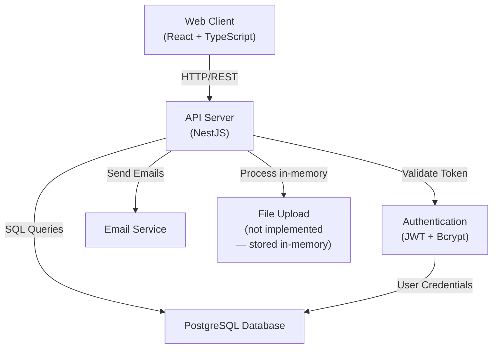

---

## 3. Request Flow & Authentication Mechanism

### 3.1 Authentication Flow

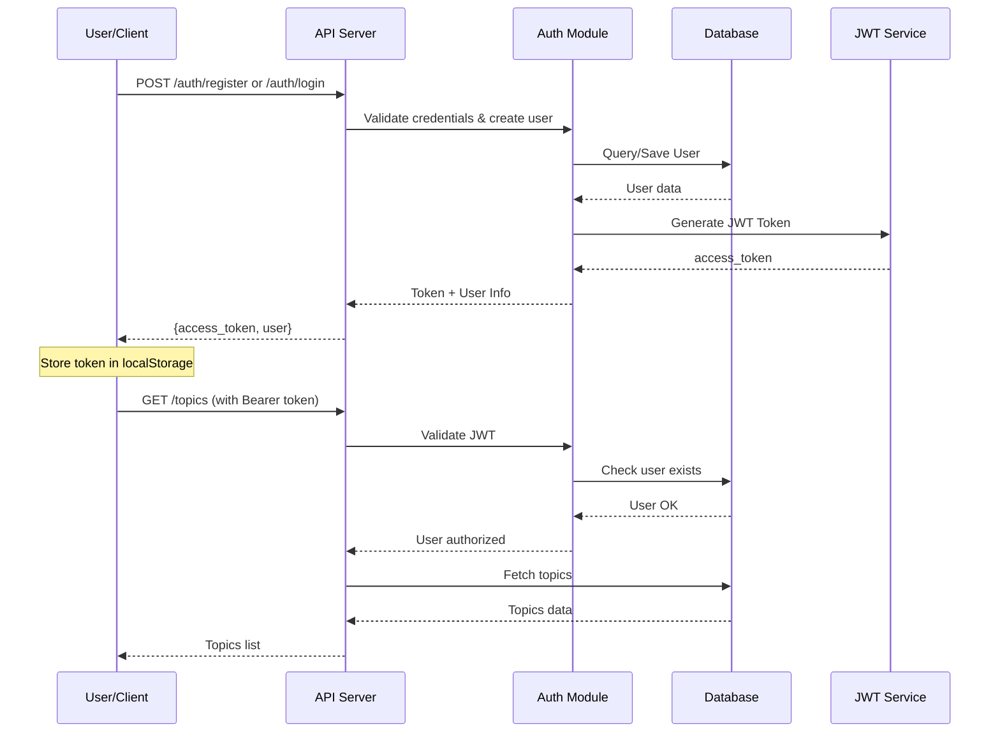

### 3.2 Authorization & Roles

- **Roles:** STUDENT, ADMIN
- **Rights-Based Access:** Fine-grained permissions assigned to roles
- **JWT Configuration:**
  - Secret: `process.env.JWT_SECRET || 'dsa-sheet-secret'`
  - Expiry: **7 days** (no refresh token mechanism)
  - Token Structure:
    ```json
    {
      "sub": "user_id",
      "email": "user@example.com",
      "roles": ["STUDENT"]
    }
    ```
- **Guard Flow:** On each authenticated request, `JwtStrategy.validate()` re-fetches the full User entity from the database (including roles and rights). Guards then operate on the DB-loaded `req.user`, not directly on JWT claims.

---

## 4. Data Flow for Core Features

### 4.1 Problem Solving & Progress Tracking

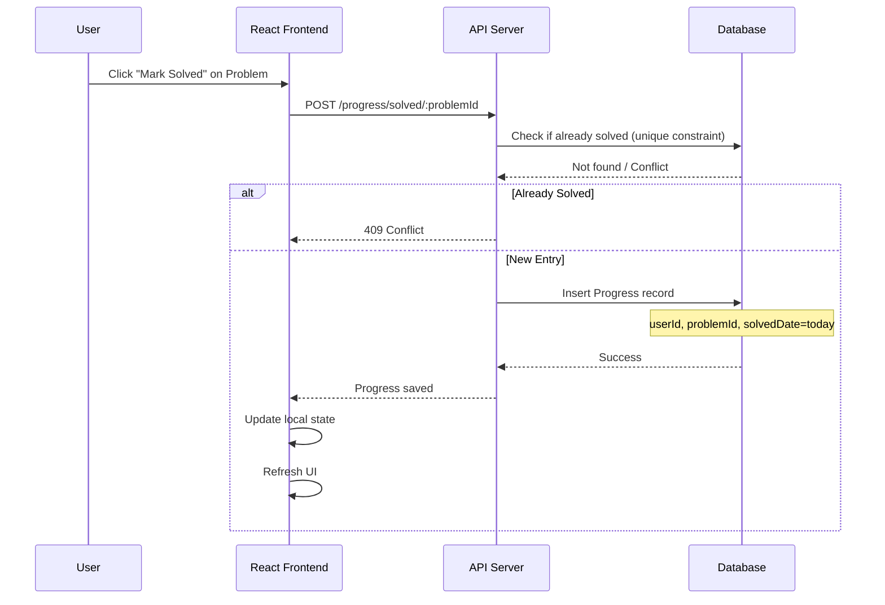

### 4.2 Progress Report Generation

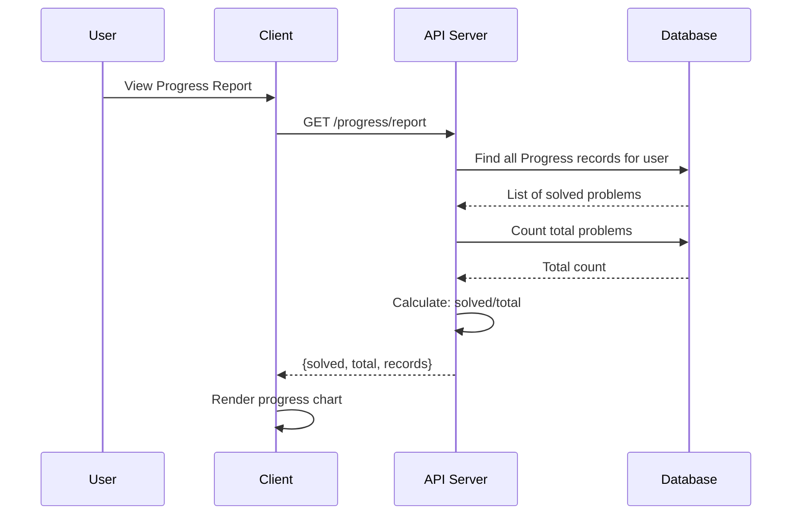

### 4.3 Daily Statistics & Streak Calculation

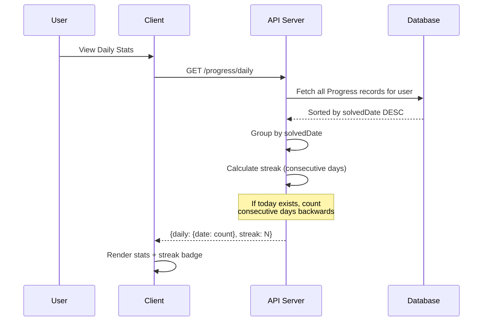

---

## 5. Core Modules & Services

### 5.1 Module Breakdown

| Module | Responsibility | Key Services |
|--------|-----------------|---------------|
| **Auth Module** | User authentication & authorization | AuthService, JwtStrategy, RolesGuard, RightsGuard |
| **User Module** | User management & CRUD operations | UserService (create, disable, change password) |
| **Topic Module** | Learning topics management | TopicService (list, get with resources & problems) |
| **Problem Module** | Problem/question management | ProblemService (CRUD, organized by topic) |
| **Progress Module** | Progress tracking & statistics | ProgressService (mark solved, calculate stats) |
| **Resource Module** | Learning materials (videos, articles) | ResourceService (CRUD by topic) |
| **Role Module** | Role definition & assignment | RoleService (create roles with rights) |
| **Rights Module** | Fine-grained permissions | RightsService (manage permission rights) |
| **Upload Module** | File upload (Excel parsing) | UploadService (parse .xlsx, create/upsert topics/problems/resources in-memory) |
| **Email Module** | Email notifications | EmailService (account creation & password change emails) |

---

## 6. API Endpoints Overview

### 6.1 Authentication Endpoints

```
POST   /auth/register              - Register new user (STUDENT role)
POST   /auth/login                 - Login with email/password
POST   /auth/admin/create-user     - Create user (ADMIN only)
GET    /auth/ping                  - Health check
```

### 6.2 Topic & Learning Content

```
GET    /topics                     - List all topics with resources & problems
GET    /topics/:id                 - Get single topic details
```

### 6.3 Progress & Tracking

```
POST   /progress/solved/:problemId - Mark problem as solved
GET    /progress/report            - Get own progress report
GET    /progress/report/:userId    - Get user progress (ADMIN)
GET    /progress/daily             - Get own daily stats & streak
GET    /progress/daily/:userId     - Get user daily stats (ADMIN)
GET    /progress/resume            - Get next unsolved problem
```

### 6.4 User Management (ADMIN)

```
GET    /users                      - List all users (with role filter)
GET    /users/:id                  - Get single user details
POST   /users                      - Create new user
PATCH  /users/:id/disable          - Toggle user disabled status
PATCH  /users/:id/change-password  - Change user password
DELETE /users/:id                  - Delete user
```

### 6.5 Problems, Resources, Roles & Rights Endpoints

```
GET    /problems                   - List all problems
GET    /problems/:id               - Get single problem
POST   /problems                   - Create problem (ADMIN)
PATCH  /problems/:id               - Update problem (ADMIN)
DELETE /problems/:id               - Delete problem (ADMIN)

GET    /resources                  - List all resources
GET    /resources/:id              - Get single resource
POST   /resources                  - Create resource (ADMIN)
PATCH  /resources/:id              - Update resource (ADMIN)
DELETE /resources/:id              - Delete resource (ADMIN)

GET    /roles                      - List roles (ADMIN)
GET    /roles/:id                  - Get single role (ADMIN)
POST   /roles                      - Create role (ADMIN)
PATCH  /roles/:id                  - Update role (ADMIN)
DELETE /roles/:id                  - Delete role (ADMIN)

GET    /rights                     - List rights (ADMIN)
GET    /rights/:id                 - Get single right (ADMIN)
POST   /rights                     - Create right (ADMIN)
DELETE /rights/:id                 - Delete right (ADMIN)

POST   /upload                     - Upload Excel file (ADMIN)
```

---

## 7. Client-Side Architecture (React)

### 7.1 Frontend Structure

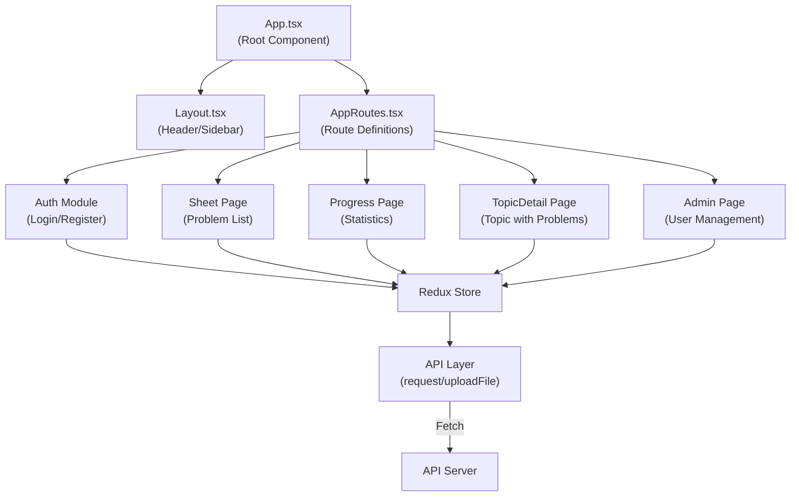

### 7.2 Redux Store Slices

- **authSlice** - Authentication state, token storage, login/logout
- **usersSlice** - User management state
- **topicsSlice** - Topics & learning content
- **progressSlice** - Problem-solving progress
- **rolesSlice** - User roles & permissions
- **rightsSlice** - Permission management

---

## 8. Request/Response Flow Example: Marking Problem as Solved

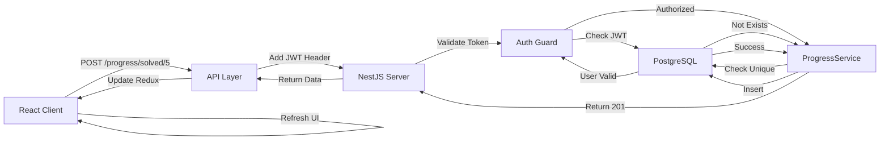

---

## 9. Scalability Considerations (10k-50k Users)

### 9.1 Database Scalability

- **Indexing Strategy:**
  - Primary indexes on all `id` columns
  - Unique indexes on `email` (User), `name` (Topic, Role, Right)
  - Foreign key indexes on all relationship columns
  - Composite index on `(userId, problemId)` for Progress uniqueness

- **Query Optimization:**
  - Eager loading of relationships (`relations: ['roles']`)
  - Selective field loading (`select: ['id', 'email']`)
  - Pagination support (can be added for large datasets)

### 9.2 API Server Scalability

- **Rate Limiting:** 100 requests per 60 seconds (ThrottlerGuard)
- **Stateless Design:** JWT tokens enable horizontal scaling
- **Load Balancing:** Multiple NestJS instances behind load balancer
- **Connection Pooling:** TypeORM manages database connections efficiently

### 9.3 Caching Strategy

- **Client-side:** Redux store caches topics, problems, user progress
- **Server-side:** Redis caching layer **(not implemented — recommended)** for frequently accessed data (topics, statistics)
- **Browser Storage:** JWT token stored in localStorage

### 9.4 Database Partitioning (Future)

- **Progress table:** Can partition by `userId` for distributed queries **(not implemented — recommended for scale)**
- **User table:** Already indexed on `email` for quick lookups
- **Problem & Topic:** Relatively static, minimal partitioning needed

### 9.5 Monitoring & Performance

- **Swagger API Docs:** Built-in at `/api/docs`
- **Logging:** Server logs all errors and email failures
- **Health Check:** `/auth/ping` endpoint for monitoring

---

## 10. Data Flow - Detailed DFD0 (Context Diagram)

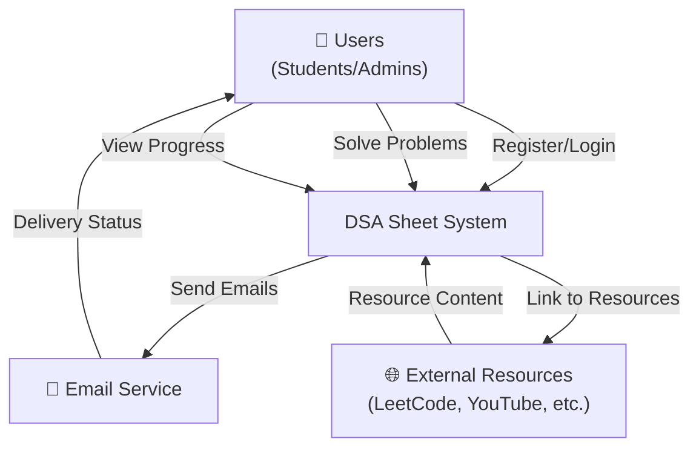

---

## 11. Data Flow - DFD Level 1 (Main Processes)

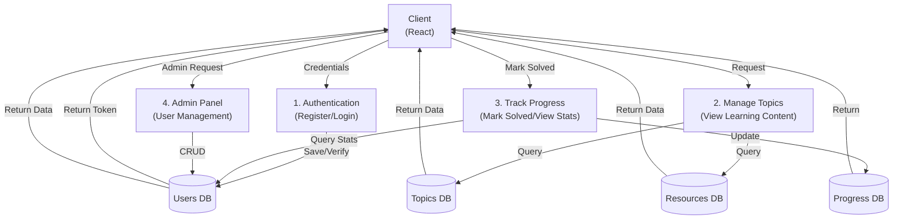

---

## 12. Deployment Architecture

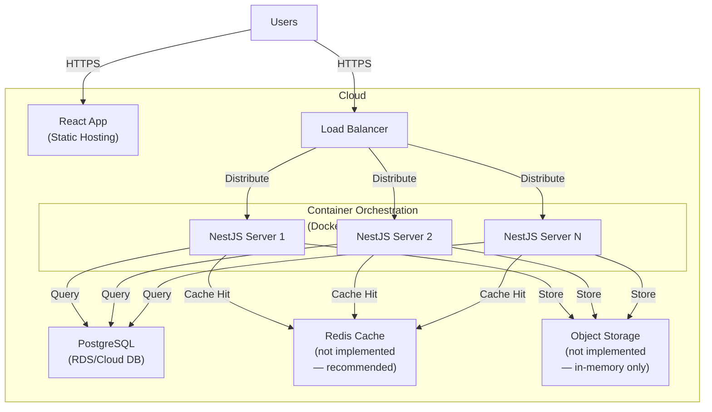

---

## 13. Security Architecture

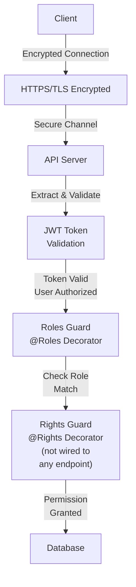

**Note:** RolesGuard is actively used on protected endpoints. RightsGuard and @Rights() decorators are defined in code but not currently applied to any controller endpoint **(not implemented — recommended for fine-grained access control)**.

---

## 14. Technology Stack

| Layer | Technology | Version |
|-------|-----------|---------|
| **Frontend** | React, TypeScript, Redux | Latest |
| **Backend** | NestJS, TypeORM | Latest |
| **Database** | PostgreSQL | 12+ |
| **Authentication** | JWT, Bcrypt | Standard |
| **API Documentation** | Swagger/OpenAPI | Built-in |
| **Validation** | NestJS ValidationPipe | Built-in |
| **Rate Limiting** | Throttler | Built-in |

---

## 15. Summary

The **Apna College DSA Sheet** is a modern, scalable learning platform built with:
- **JWT-based stateless authentication** for horizontal scaling
- **Role & rights-based access control** for flexible permissions
- **Progress tracking with streak calculation** for user engagement
- **RESTful API** with comprehensive Swagger documentation
- **React frontend** with Redux state management
- **PostgreSQL database** with proper indexing for 10k-50k users

The architecture supports **10k-50k concurrent users** through load balancing, connection pooling, rate limiting, and database optimization.

---

## 16. Recommended Improvements (Not Yet Implemented)

The following features are valuable enhancements that can be added to improve scalability, security, and user experience:

1. **Redis Caching Layer** — Cache frequently accessed topics, problems, and progress statistics for faster response times
2. **Object/File Storage** — Persistent file storage (AWS S3 or equivalent) for uploaded Excel files instead of in-memory processing
3. **Apply RightsGuard to Endpoints** — Wire @Rights() decorators to protect endpoints with fine-grained permissions (currently defined but unused)
4. **Email on Password Change** — Connect the existing `sendPasswordChanged` email method to the password change endpoint
5. **JWT Refresh Token Mechanism** — Implement refresh tokens to extend sessions beyond 7 days without requiring re-login
6. **Pagination** — Add pagination to `/users` and `/problems` endpoints for scalability
7. **File Upload Validation** — Add file size limits and MIME type validation to the `/upload` endpoint
8. **Frontend Route Guards** — Add role-based route protection on the `/admin` route (currently only checked in component)
9. **Persist Solved Problems** — Save solved problem state to Redux/database to persist across page reloads (currently lost on refresh)
10. **CORS Origin Restrictions** — Configure specific allowed origins instead of fully open CORS
11. **Wired Delete User Button** — Connect the existing `deleteUser` Redux action to the Admin UI (currently imported but unused)
