# Apna College - Low-Level Design (LLD)

## 1. Database Schema Design

### 1.1 Complete Entity Relationship Diagram

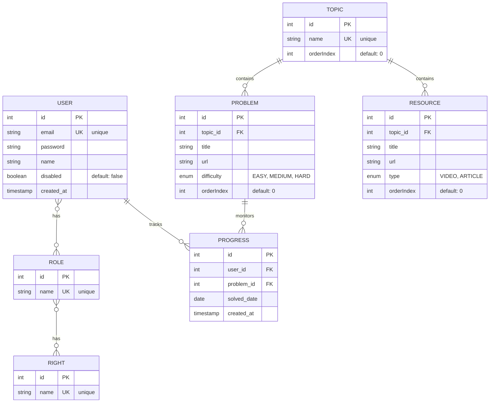

---

## 2. Detailed Table Schemas

### 2.1 User Table

```sql
CREATE TABLE "user" (
  id SERIAL PRIMARY KEY,
  email TEXT UNIQUE NOT NULL,
  password TEXT NOT NULL,
  name TEXT NOT NULL,
  disabled BOOLEAN DEFAULT false,
  created_at TIMESTAMP DEFAULT CURRENT_TIMESTAMP
);

-- Indexes
CREATE INDEX idx_user_email ON "user"(email);
CREATE INDEX idx_user_created_at ON "user"(created_at DESC);
```

**Columns:**
- `id`: Auto-incrementing primary key
- `email`: Unique email for login (indexed for quick lookup)
- `password`: Bcrypt-hashed password (10 rounds)
- `name`: User's full name
- `disabled`: Soft-disable flag (user cannot login if true)
- `created_at`: Account creation timestamp

---

### 2.2 Role Table

```sql
CREATE TABLE "role" (
  id SERIAL PRIMARY KEY,
  name TEXT UNIQUE NOT NULL
);

-- Indexes
CREATE INDEX idx_role_name ON "role"(name);

-- Seed Data
INSERT INTO "role" (name) VALUES ('STUDENT'), ('ADMIN');
```

**Columns:**
- `id`: Auto-incrementing primary key
- `name`: Unique role identifier (STUDENT, ADMIN, etc.)

**Predefined Roles:**
- **STUDENT**: Can view topics, problems, resources, mark progress
- **ADMIN**: Full access including user management and data administration

---

### 2.3 Right Table

```sql
CREATE TABLE "right" (
  id SERIAL PRIMARY KEY,
  name TEXT UNIQUE NOT NULL
);

-- Indexes
CREATE INDEX idx_right_name ON "right"(name);

-- Seed Data (from SeedService on app startup)
INSERT INTO "right" (name) VALUES 
  ('VIEW_SHEET'),
  ('SOLVE_PROBLEM'),
  ('ADMIN'),
  ('VIEW_CONTENT'),
  ('ADD_CONTENT'),
  ('DELETE_CONTENT');
```

**Columns:**
- `id`: Auto-incrementing primary key
- `name`: Unique permission identifier

**Permission Model:**
- Rights are assigned to roles
- Users inherit rights through their assigned roles
- Fine-grained access control via decorators: `@Rights('manage:users')`

---

### 2.4 User_Roles Junction Table

```sql
CREATE TABLE "user_roles" (
  user_id INT NOT NULL,
  role_id INT NOT NULL,
  PRIMARY KEY (user_id, role_id),
  FOREIGN KEY (user_id) REFERENCES "user"(id) ON DELETE CASCADE,
  FOREIGN KEY (role_id) REFERENCES "role"(id) ON DELETE CASCADE
);

-- Indexes
CREATE INDEX idx_user_roles_user_id ON "user_roles"(user_id);
CREATE INDEX idx_user_roles_role_id ON "user_roles"(role_id);
```

**Many-to-Many Relationship:**
- A user can have multiple roles
- A role can be assigned to multiple users
- Cascading delete: removing user deletes all role assignments

---

### 2.5 Role_Rights Junction Table

```sql
CREATE TABLE "role_rights" (
  role_id INT NOT NULL,
  right_id INT NOT NULL,
  PRIMARY KEY (role_id, right_id),
  FOREIGN KEY (role_id) REFERENCES "role"(id) ON DELETE CASCADE,
  FOREIGN KEY (right_id) REFERENCES "right"(id) ON DELETE CASCADE
);

-- Indexes
CREATE INDEX idx_role_rights_role_id ON "role_rights"(role_id);
CREATE INDEX idx_role_rights_right_id ON "role_rights"(right_id);
```

**Many-to-Many Relationship:**
- A role has multiple rights
- A right can be assigned to multiple roles
- Cascading delete: removing role deletes all right assignments

---

### 2.6 Topic Table

```sql
CREATE TABLE "topic" (
  id SERIAL PRIMARY KEY,
  name TEXT UNIQUE NOT NULL,
  orderIndex INT DEFAULT 0
);

-- Indexes
CREATE INDEX idx_topic_name ON "topic"(name);
CREATE INDEX idx_topic_orderIndex ON "topic"(orderIndex);
```

**Columns:**
- `id`: Auto-incrementing primary key
- `name`: Unique topic name (e.g., "Arrays", "Trees", "Graphs")
- `orderIndex`: Display order for UI rendering

**Purpose:** Organize problems and resources by topic/concept

---

### 2.7 Problem Table

```sql
CREATE TABLE "problem" (
  id SERIAL PRIMARY KEY,
  topic_id INT NOT NULL,
  title TEXT NOT NULL,
  url TEXT NOT NULL,
  difficulty VARCHAR(10) DEFAULT 'MEDIUM' CHECK(difficulty IN ('EASY', 'MEDIUM', 'HARD')),
  orderIndex INT DEFAULT 0,
  FOREIGN KEY (topic_id) REFERENCES "topic"(id) ON DELETE CASCADE
);

-- Indexes
CREATE INDEX idx_problem_topic_id ON "problem"(topic_id);
CREATE INDEX idx_problem_difficulty ON "problem"(difficulty);
CREATE INDEX idx_problem_orderIndex ON "problem"(orderIndex);
```

**Columns:**
- `id`: Auto-incrementing primary key
- `topic_id`: Foreign key to Topic (cascading delete)
- `title`: Problem name/title (e.g., "Two Sum")
- `url`: External link to problem (LeetCode, HackerRank, etc.)
- `difficulty`: EASY | MEDIUM | HARD enum
- `orderIndex`: Display/solving order within topic

**Relationships:**
- One topic has many problems (1:N)
- Problems are deleted when topic is deleted (CASCADE)

---

### 2.8 Resource Table

```sql
CREATE TABLE "resource" (
  id SERIAL PRIMARY KEY,
  topic_id INT NOT NULL,
  title TEXT NOT NULL,
  url TEXT NOT NULL,
  type VARCHAR(10) DEFAULT 'ARTICLE' CHECK(type IN ('VIDEO', 'ARTICLE')),
  orderIndex INT DEFAULT 0,
  FOREIGN KEY (topic_id) REFERENCES "topic"(id) ON DELETE CASCADE
);

-- Indexes
CREATE INDEX idx_resource_topic_id ON "resource"(topic_id);
CREATE INDEX idx_resource_type ON "resource"(type);
CREATE INDEX idx_resource_orderIndex ON "resource"(orderIndex);
```

**Columns:**
- `id`: Auto-incrementing primary key
- `topic_id`: Foreign key to Topic (cascading delete)
- `title`: Resource title (e.g., "Arrays Introduction")
- `url`: External link to resource (YouTube video, blog article, etc.)
- `type`: VIDEO | ARTICLE enum
- `orderIndex`: Display order within topic

**Relationships:**
- One topic has many resources (1:N)
- Resources are deleted when topic is deleted (CASCADE)

---

### 2.9 Progress Table

```sql
CREATE TABLE "progress" (
  id SERIAL PRIMARY KEY,
  user_id INT NOT NULL,
  problem_id INT NOT NULL,
  solved_date DATE NOT NULL,
  created_at TIMESTAMP DEFAULT CURRENT_TIMESTAMP,
  UNIQUE(user_id, problem_id),
  FOREIGN KEY (user_id) REFERENCES "user"(id) ON DELETE CASCADE,
  FOREIGN KEY (problem_id) REFERENCES "problem"(id) ON DELETE CASCADE
);

-- Indexes
CREATE INDEX idx_progress_user_id ON "progress"(user_id);
CREATE INDEX idx_progress_problem_id ON "progress"(problem_id);
CREATE INDEX idx_progress_solved_date ON "progress"(solved_date DESC);
CREATE INDEX idx_progress_created_at ON "progress"(created_at DESC);
CREATE INDEX idx_progress_user_solved_date ON "progress"(user_id, solved_date DESC);
```

**Columns:**
- `id`: Auto-incrementing primary key
- `user_id`: Foreign key to User (cascading delete)
- `problem_id`: Foreign key to Problem (cascading delete)
- `solved_date`: Date when problem was solved (YYYY-MM-DD format)
- `created_at`: Timestamp when record was created (for audit)
- **UNIQUE constraint:** Each user can mark each problem as solved only once

**Relationships:**
- One user has many progress records (1:N)
- One problem has many progress records (1:N)
- Records are deleted when user or problem is deleted (CASCADE)

**Usage:**
- Store when each user solves a problem
- Calculate daily stats grouped by `solved_date`
- Calculate streaks by analyzing consecutive dates
- Calculate total solved count by `COUNT(*) WHERE user_id = X`

---

## 3. Class Diagram

### 3.1 Entity Classes

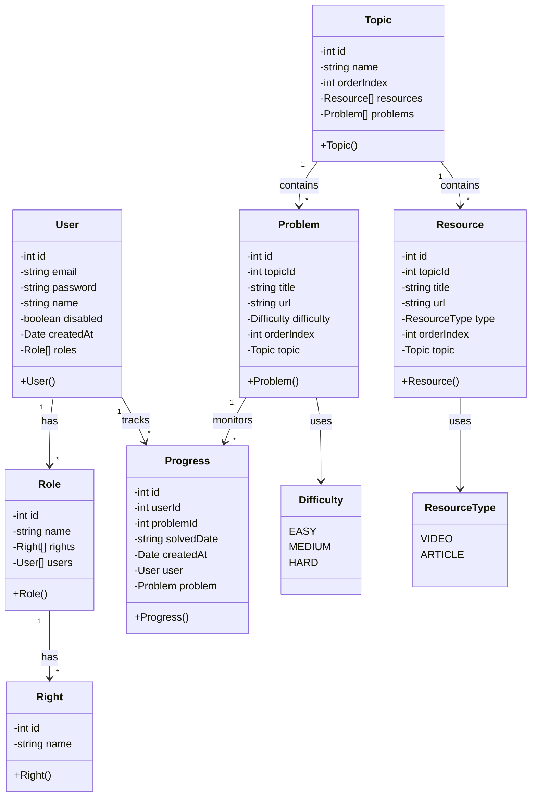

---

## 4. Service Layer Architecture

### 4.1 Core Services

#### 4.1.1 AuthService

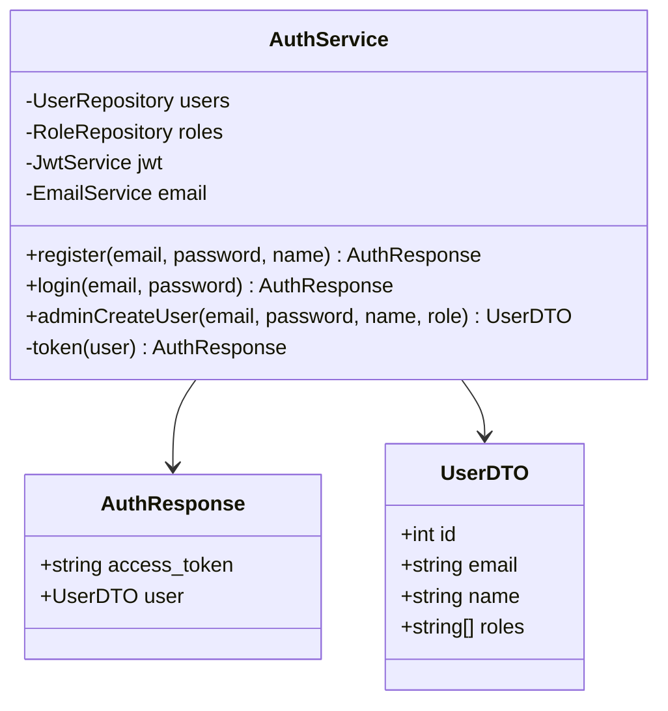

**Methods:**
- `register()`: Self-registration with STUDENT role
- `login()`: Email/password authentication, returns JWT token
- `adminCreateUser()`: Admin-only user creation with custom role
- `token()`: Internal method to generate JWT payload

---

#### 4.1.2 ProgressService

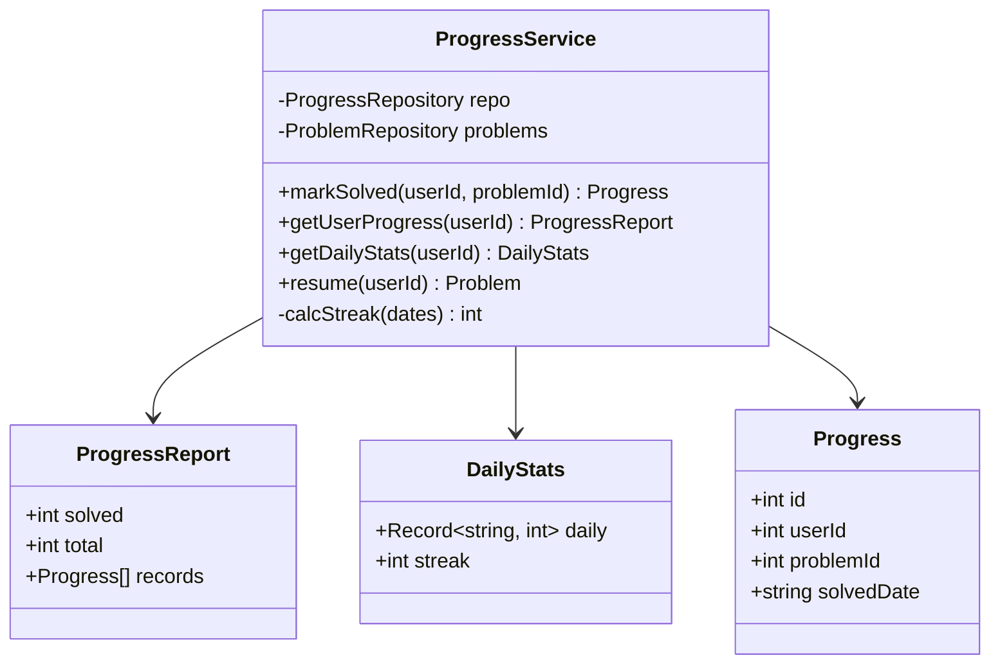

**Methods:**
- `markSolved()`: Insert new progress record (checks unique constraint)
- `getUserProgress()`: Return solved count, total problems, and problem list
- `getDailyStats()`: Calculate daily problem counts and current streak
- `resume()`: Find first unsolved problem for user (for resume functionality)
- `calcStreak()`: Calculate consecutive day streak ending today

---

#### 4.1.3 UserService

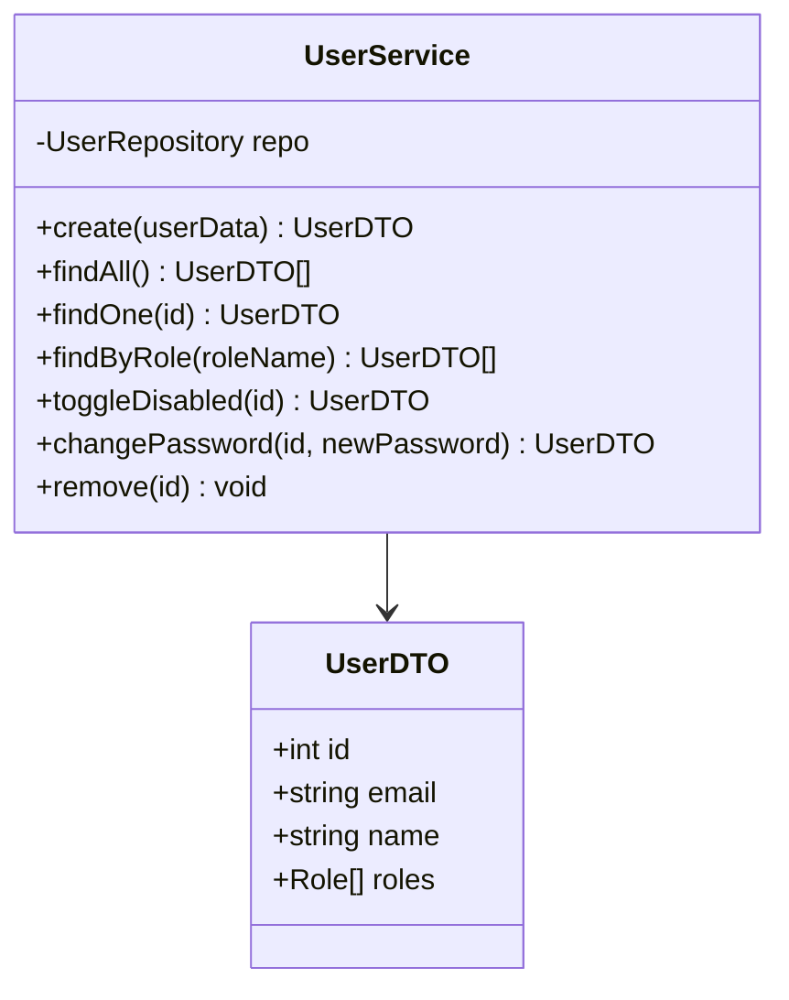

**Methods:**
- `create()`: Admin-only user creation
- `findAll()`: List all users with roles
- `findOne()`: Get single user by ID
- `findByRole()`: Filter users by role name
- `toggleDisabled()`: Enable/disable user login
- `changePassword()`: Admin password reset, hashes and saves new password. Email sending not wired **(not implemented — recommended)**
- `remove()`: Delete user (cascading delete of progress)

---

#### 4.1.4 TopicService

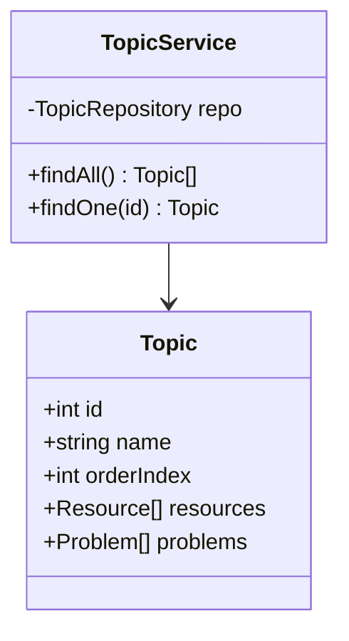

**Methods:**
- `findAll()`: Return all topics with eager-loaded resources and problems
- `findOne()`: Get single topic with all related content

---

#### 4.1.5 ProblemService

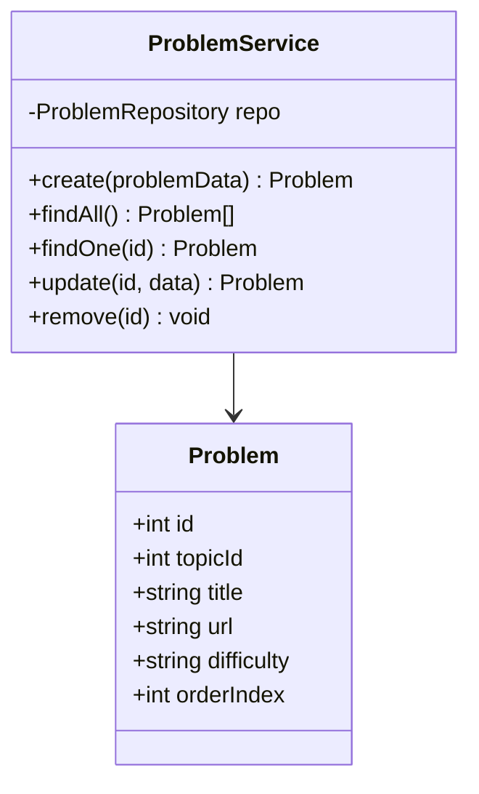

---

#### 4.1.6 ResourceService

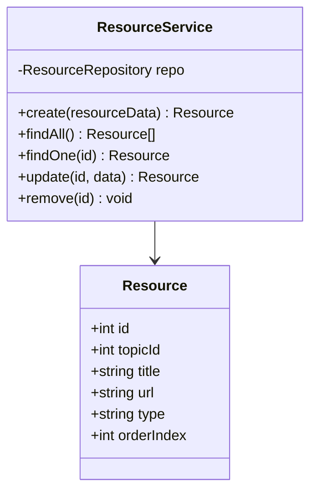

---

## 5. Controller Layer Architecture

### 5.1 Endpoint Details

#### 5.1.1 Auth Controller

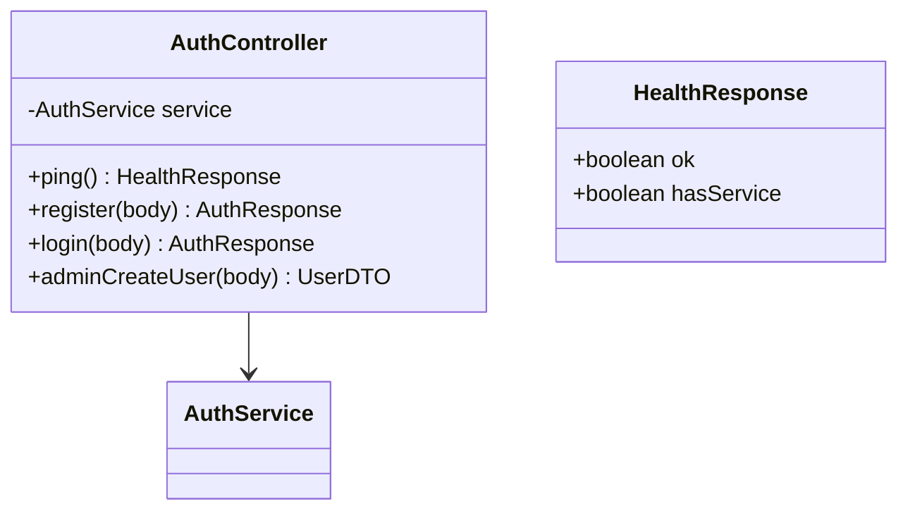

| Method | Endpoint | Auth | Params | Returns |
|--------|----------|------|--------|---------|
| POST | `/auth/register` | None | email, password, name | AuthResponse |
| POST | `/auth/login` | None | email, password | AuthResponse |
| POST | `/auth/admin/create-user` | JWT + ADMIN | email, password, name, role | UserDTO |
| GET | `/auth/ping` | None | — | HealthResponse |

---

#### 5.1.2 Progress Controller

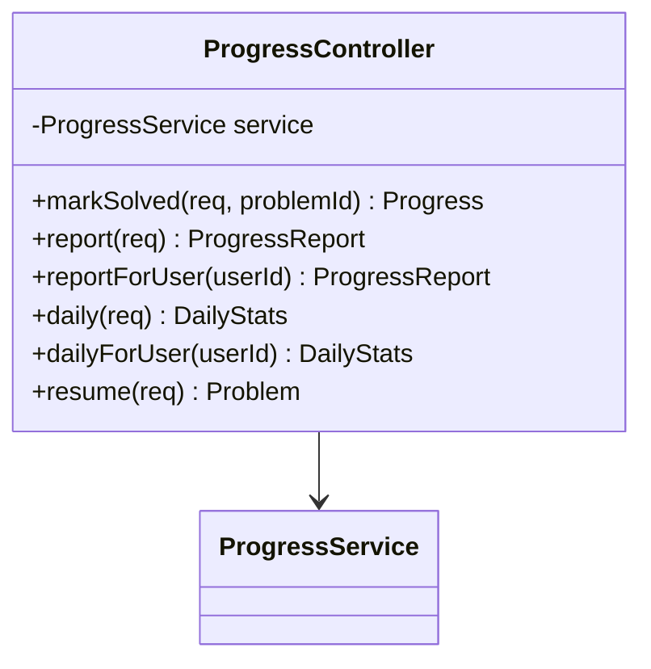

| Method | Endpoint | Auth | Params | Returns |
|--------|----------|------|--------|---------|
| POST | `/progress/solved/:problemId` | JWT | problemId | Progress |
| GET | `/progress/report` | JWT | — | ProgressReport |
| GET | `/progress/report/:userId` | JWT + ADMIN | userId | ProgressReport |
| GET | `/progress/daily` | JWT | — | DailyStats |
| GET | `/progress/daily/:userId` | JWT + ADMIN | userId | DailyStats |
| GET | `/progress/resume` | JWT | — | Problem |

---

#### 5.1.3 Topic Controller

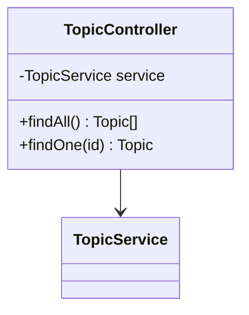

| Method | Endpoint | Auth | Params | Returns |
|--------|----------|------|--------|---------|
| GET | `/topics` | JWT | — | Topic[] |
| GET | `/topics/:id` | JWT | topicId | Topic |

---

#### 5.1.4 User Controller

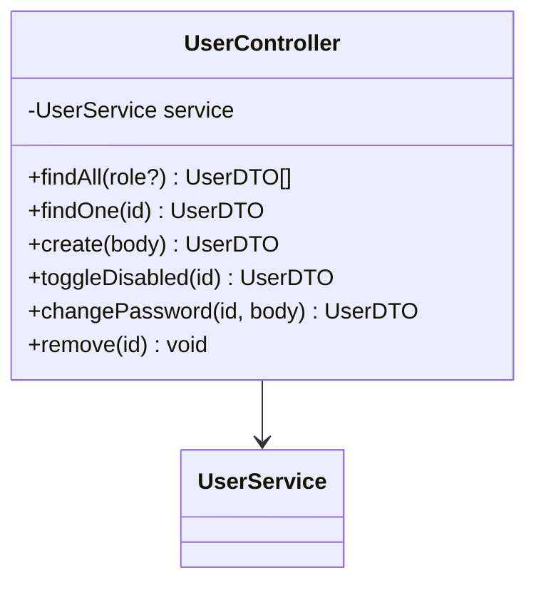

| Method | Endpoint | Auth | Params | Returns |
|--------|----------|------|--------|---------|
| GET | `/users` | JWT + ADMIN | role (optional) | UserDTO[] |
| GET | `/users/:id` | JWT + ADMIN | userId | UserDTO |
| POST | `/users` | JWT + ADMIN | email, password, name | UserDTO |
| PATCH | `/users/:id/disable` | JWT + ADMIN | userId | UserDTO |
| PATCH | `/users/:id/change-password` | JWT + ADMIN | userId, password | UserDTO |
| DELETE | `/users/:id` | JWT + ADMIN | userId | void |

---

## 6. Guard & Decorator Implementation

### 6.1 Authentication Guard (JWT)

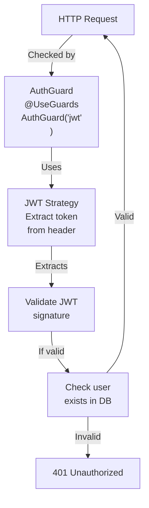

**JWT Token Structure:**
```json
{
  "sub": 1,
  "email": "user@example.com",
  "roles": ["STUDENT"],
  "iat": 1234567890,
  "exp": 1234654290
}
```

---

### 6.2 Roles Guard

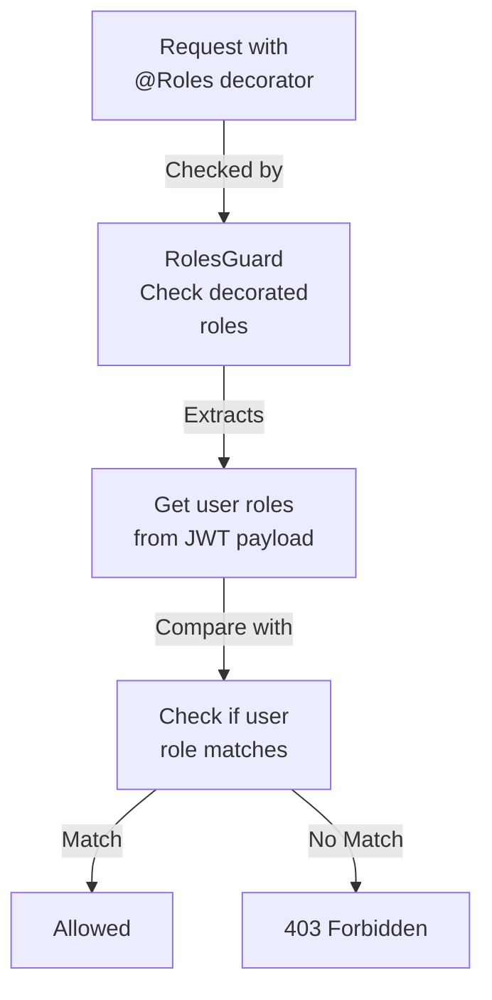

**Usage Example:**
```typescript
@UseGuards(AuthGuard('jwt'), RolesGuard)
@Roles('ADMIN')
@Get('users')
```

---

### 6.3 Rights Guard


**Usage Example:**
```typescript
@UseGuards(AuthGuard('jwt'), RightsGuard)
@Rights('manage:users')
@Delete('users/:id')
```

**Note:** RightsGuard and @Rights() decorators are defined in the codebase but are **not wired to any controller endpoint** **(not implemented — recommended for fine-grained access control)**. Currently, only RolesGuard is used on protected endpoints.

---

## 7. Module Dependencies

### 7.1 Dependency Injection Graph

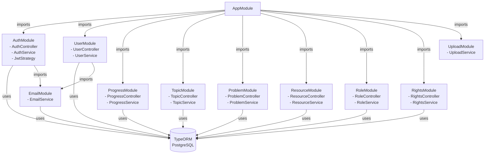

---

## 8. Query Optimization & Indexing Strategy

### 8.1 Critical Indexes

```sql
-- User Authentication
CREATE INDEX idx_user_email ON "user"(email);  -- O(log n) lookup during login

-- Progress Tracking
CREATE INDEX idx_progress_user_id ON "progress"(user_id);  -- O(log n) user stats
CREATE UNIQUE INDEX idx_progress_unique ON "progress"(user_id, problem_id);  -- Prevent duplicates

-- Daily Statistics
CREATE INDEX idx_progress_user_solved_date ON "progress"(user_id, solved_date DESC);  -- O(log n) daily aggregation

-- Content Organization
CREATE INDEX idx_problem_topic_id ON "problem"(topic_id);  -- O(log n) problems by topic
CREATE INDEX idx_resource_topic_id ON "resource"(topic_id);  -- O(log n) resources by topic

-- Filtering & Sorting
CREATE INDEX idx_topic_orderIndex ON "topic"(orderIndex);  -- O(log n) ordered list display
CREATE INDEX idx_problem_orderIndex ON "problem"(orderIndex);  -- O(log n) ordered list display
```

### 8.2 Query Examples with Index Usage

```sql
-- Fast: User login (uses idx_user_email)
SELECT * FROM "user" WHERE email = 'user@example.com';
-- Expected time: O(log n)

-- Fast: Get user progress (uses idx_progress_user_id)
SELECT * FROM "progress" WHERE user_id = 5;
-- Expected time: O(log n) to (log n + m) where m = solved count

-- Fast: Get daily stats (uses idx_progress_user_solved_date)
SELECT solved_date, COUNT(*) FROM "progress" 
WHERE user_id = 5 GROUP BY solved_date;
-- Expected time: O(log n) + aggregation

-- Fast: Get problems by topic (uses idx_problem_topic_id)
SELECT * FROM "problem" WHERE topic_id = 3 ORDER BY orderIndex;
-- Expected time: O(log n + k) where k = problems in topic
```

---

## 9. Data Consistency & Constraints

### 9.1 Unique Constraints

| Table | Columns | Reason |
|-------|---------|--------|
| `user` | `email` | Prevent duplicate accounts |
| `role` | `name` | Prevent duplicate role definitions |
| `right` | `name` | Prevent duplicate permission definitions |
| `topic` | `name` | Prevent duplicate topic names |
| `progress` | `(user_id, problem_id)` | Prevent marking same problem solved twice |

### 9.2 Foreign Key Constraints with Cascading Delete

| From | To | Cascade | Reason |
|------|----|---------|----|
| `progress` | `user` | DELETE CASCADE | Delete user → remove their progress records |
| `progress` | `problem` | DELETE CASCADE | Delete problem → remove all progress entries |
| `problem` | `topic` | DELETE CASCADE | Delete topic → remove all problems |
| `resource` | `topic` | DELETE CASCADE | Delete topic → remove all resources |
| `user_roles` | `user` | DELETE CASCADE | Delete user → remove role assignments |
| `user_roles` | `role` | DELETE CASCADE | Delete role → remove assignments |
| `role_rights` | `role` | DELETE CASCADE | Delete role → remove right assignments |
| `role_rights` | `right` | DELETE CASCADE | Delete right → remove from roles |

---

## 10. TypeORM Configuration

### 10.1 Database Connection Setup

```typescript
TypeOrmModule.forRoot({
  type: 'postgres',
  host: process.env.DB_HOST || 'localhost',
  port: Number(process.env.DB_PORT) || 5432,
  username: process.env.DB_USERNAME || 'postgres',
  password: process.env.DB_PASSWORD || 'root',
  database: process.env.DB_NAME || 'dsasheet',
  autoLoadEntities: true,  // Auto-discover entities
  synchronize: true,        // Auto-create tables (dev only)
});
```

### 10.2 Entity Relationships

```typescript
// One-to-Many: Topic -> Problems
@OneToMany(() => Problem, (p) => p.topic)
problems: Problem[];

// Many-to-One: Problem -> Topic
@ManyToOne(() => Topic, (t) => t.problems, { onDelete: 'CASCADE' })
@JoinColumn({ name: 'topic_id' })
topic: Topic;

// Many-to-Many: User <-> Role (with junction table)
@ManyToMany(() => Role)
@JoinTable({ name: 'user_roles' })
roles: Role[];

// Many-to-Many: Role <-> Right
@ManyToMany(() => Right)
@JoinTable({ name: 'role_rights' })
rights: Right[];
```

---

## 11. Data Type Mapping

| Entity Field | Type | SQL Type | Constraints |
|--------------|------|----------|-------------|
| `user.id` | `number` | `SERIAL` | PRIMARY KEY, AUTO_INCREMENT |
| `user.email` | `string` | `TEXT` | UNIQUE, NOT NULL |
| `user.password` | `string` | `TEXT` | NOT NULL (bcrypt hash) |
| `user.disabled` | `boolean` | `BOOLEAN` | DEFAULT false |
| `user.createdAt` | `Date` | `TIMESTAMP` | DEFAULT CURRENT_TIMESTAMP |
| `problem.difficulty` | `enum(Difficulty)` | `VARCHAR(10)` | CHECK IN ('EASY','MEDIUM','HARD') |
| `resource.type` | `enum(ResourceType)` | `VARCHAR(10)` | CHECK IN ('VIDEO','ARTICLE') |
| `progress.solvedDate` | `string` (YYYY-MM-DD) | `DATE` | NOT NULL |
| `orderIndex` | `number` | `INT` | DEFAULT 0 |

---

## 12. Capacity Planning

### 12.1 Storage Estimation (50k users)

```
User table:         50,000 rows × 150 bytes ≈ 7.5 MB
Role table:         10 rows × 50 bytes ≈ 500 B
Right table:        20 rows × 50 bytes ≈ 1 KB
Topic table:        50 rows × 100 bytes ≈ 5 KB
Problem table:      500 rows × 200 bytes ≈ 100 KB
Resource table:     500 rows × 200 bytes ≈ 100 KB
Progress table:     250,000 rows × 50 bytes ≈ 12.5 MB (avg 5 problems/user)

TOTAL:              ≈ 20 MB (including indexes, overhead ~30%)
Expected DB Size:   ≈ 50-100 MB
```

### 12.2 Query Performance Targets

| Operation | Expected Time | Target |
|-----------|---------------|--------|
| User login (email lookup) | O(log n) | < 10ms |
| Get all topics | O(m) where m = topics | < 50ms |
| Get topic with problems | O(m + k) where k = problems | < 100ms |
| Get user progress | O(log n + p) where p = solved | < 50ms |
| Mark problem solved | O(log n) | < 20ms |
| Calculate daily stats | O(p) where p = solved | < 100ms |

---

## 13. API Response DTOs

### 13.1 Authentication Response

```typescript
interface AuthResponse {
  access_token: string;
  user: {
    id: number;
    email: string;
    name: string;
    roles: string[];
  };
}
```

### 13.2 Progress Report

```typescript
interface ProgressReport {
  solved: number;
  total: number;
  records: Array<{
    id: number;
    userId: number;
    problemId: number;
    solvedDate: string;
    createdAt: Date;
    problem: {
      id: number;
      topicId: number;
      title: string;
      url: string;
      difficulty: string;
      orderIndex: number;
    };
  }>;
}
```

### 13.3 Daily Statistics

```typescript
interface DailyStats {
  daily: Record<string, number>;  // { "2024-05-11": 3, "2024-05-10": 2 }
  streak: number;                 // 5 (consecutive days)
}
```

---

## 14. Summary

The **LLD** defines:
- **9 core tables** with proper normalization (3NF)
- **Primary keys, foreign keys, and unique constraints** for data integrity
- **10+ strategic indexes** for O(log n) query performance
- **Cascade delete** relationships for referential integrity
- **Enum constraints** for type safety (Difficulty, ResourceType)
- **Composite indexes** for complex queries (daily stats, user progress)
- **Support for 50k users** with estimated 50-100 MB database size

The design ensures:
- **Data consistency** through constraints and transactions
- **Scalability** through proper indexing and query optimization
- **Maintainability** through clear relationships and entity design
- **Performance** with sub-100ms response times for core operations

---

## 15. Recommended Improvements (Not Yet Implemented)

The following enhancements can strengthen the database design, API security, and data integrity:

1. **Apply RightsGuard to Endpoints** — Wire @Rights() decorators to enforce fine-grained permission checks on resource endpoints (e.g., `@Rights('ADD_CONTENT')` on POST /problems)
2. **Email on Password Change** — Connect the existing `EmailService.sendPasswordChanged()` method to the password change endpoint for user notification
3. **Pagination with Cursor/Offset** — Add pagination to `/users`, `/problems`, `/resources` endpoints with configurable limits
4. **File Upload Persistence** — Store uploaded Excel files to S3 or persistent disk storage instead of processing only in-memory
5. **Rate Limiting per User** — Enhance ThrottlerModule to track rate limits by user ID, not just by IP
6. **Soft Deletes** — Add a `deleted_at` timestamp to Progress, Problem, Resource tables to support soft-delete operations and audit trails
7. **Audit Logging** — Track all user modifications (create/update/delete) with timestamps and user IDs in dedicated audit tables
8. **JWT Refresh Token** — Implement refresh token rotation to extend sessions beyond 7-day expiry without requiring re-login
9. **Wired Delete User** — Wire the `UserService.deleteUser()` action to the Admin UI (thunk exists but is unused in components)
10. **Pagination on Frontend** — Persist solved-problem state to database instead of losing it on page reload (currently only in local React state)
11. **Secure Password Reset** — Implement time-limited reset tokens instead of auto-generating passwords
12. **CORS Origin Whitelist** — Replace fully open CORS with a whitelist of allowed origins
